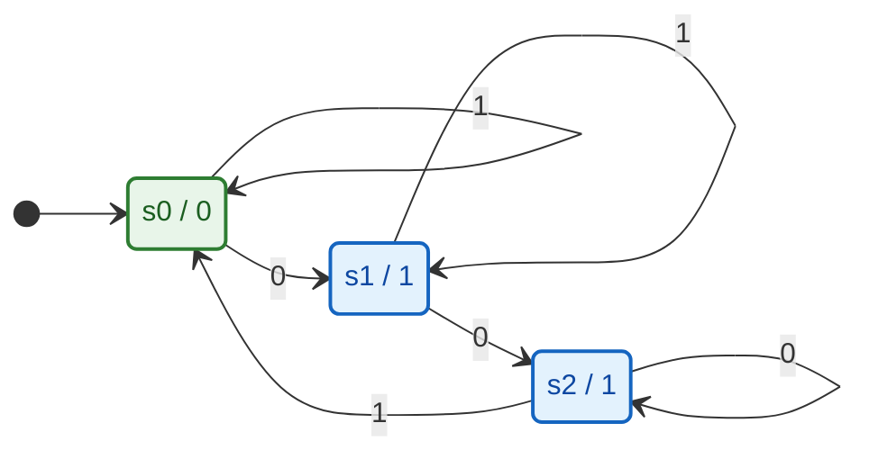
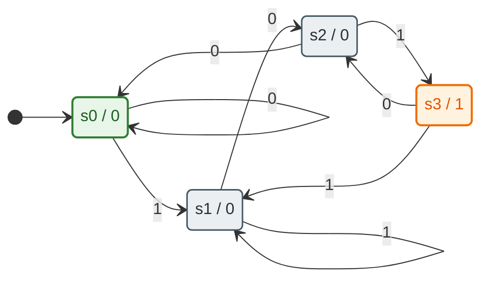

# Trabalho 1 - Maquinas de Estados Finitos

Este projeto contem duas simulacoes graficas de maquinas de estados finitos implementadas em Python com Tkinter.

As duas implementacoes usam o modelo de maquina de Moore:

- a proxima transicao depende do estado atual e da entrada
- a saida depende apenas do estado atual

## Arquivos do projeto

- `maquina_1.py`: simulacao da primeira maquina de estados
- `maquina_2.py`: simulacao da segunda maquina, rotulada como detector `101`
- `requirements.txt`: arquivo de dependencias Python via `pip` (atualmente vazio)

## Requisitos

Para executar no Ubuntu:

```bash
sudo apt update
sudo apt install -y python3 python3-pip python3-venv python3-tk
```

Opcionalmente, crie um ambiente virtual:

```bash
python3 -m venv .venv
source .venv/bin/activate
python -m pip install --upgrade pip
pip install -r requirements.txt
```

Observacao: o projeto nao usa bibliotecas externas de `pip`; a interface grafica depende do modulo `tkinter`, que no Ubuntu normalmente vem do pacote de sistema `python3-tk`.

## Como executar

Execute uma das maquinas abaixo:

```bash
python maquina_1.py
```

ou

```bash
python maquina_2.py
```

Ao abrir a janela:

- `Entrada 0` aplica o simbolo `0`
- `Entrada 1` aplica o simbolo `1`
- `Reset` retorna ao estado inicial `s0`

O estado atual e destacado em verde, e a saida mostrada na interface corresponde ao vetor de saidas da maquina.

## Maquina 1

### Definicao

Tabela de transicao:

```text
TE = [
  [1, 0],  # s0
  [2, 1],  # s1
  [2, 0]   # s2
]
```

Saidas:

```text
VS = [0, 1, 1]
```

Estado inicial: `s0`

### Tabela de estados

| Estado atual | Entrada 0 | Entrada 1 | Saida |
| --- | --- | --- | --- |
| s0 | s1 | s0 | 0 |
| s1 | s2 | s1 | 1 |
| s2 | s2 | s0 | 1 |

### Interpretacao

- `s0` e o estado inicial com saida `0`
- `s1` e `s2` possuem saida `1`
- a maquina muda de estado conforme a entrada informada pelos botoes da interface

### UML da maquina 1



## Maquina 2

### Definicao

Tabela de transicao:

```text
TE = [
  [0, 1],  # s0
  [2, 1],  # s1
  [0, 3],  # s2
  [2, 1]   # s3
]
```

Saidas:

```text
VS = [0, 0, 0, 1]
```

Estado inicial: `s0`

### Tabela de estados

| Estado atual | Entrada 0 | Entrada 1 | Saida |
| --- | --- | --- | --- |
| s0 | s0 | s1 | 0 |
| s1 | s2 | s1 | 0 |
| s2 | s0 | s3 | 0 |
| s3 | s2 | s1 | 1 |

### Interpretacao

Pelo titulo da janela, esta maquina representa um detector da sequencia `101`.

Uma leitura possivel dos estados e:

- `s0`: nenhum prefixo relevante foi reconhecido
- `s1`: o simbolo `1` foi reconhecido
- `s2`: a sequencia `10` foi reconhecida
- `s3`: a sequencia `101` foi reconhecida, gerando saida `1`

### UML da maquina 2



## Estrutura conceitual

Em ambas as maquinas, a logica central e representada por duas estruturas:

- `TE` (tabela de estados): define o proximo estado para cada combinacao de estado atual e entrada
- `VS` (vetor de saidas): define a saida associada a cada estado

A cada clique em um botao de entrada:

1. a entrada `0` ou `1` e lida
2. o estado atual e atualizado pela tabela `TE`
3. a interface e redesenhada
4. a saida do novo estado e exibida

## Observacoes

- as implementacoes sao didaticas e focadas em visualizacao
- os diagramas no codigo sao desenhados manualmente com `Canvas`
- os diagramas UML acima usam Mermaid, o que facilita documentacao em Markdown