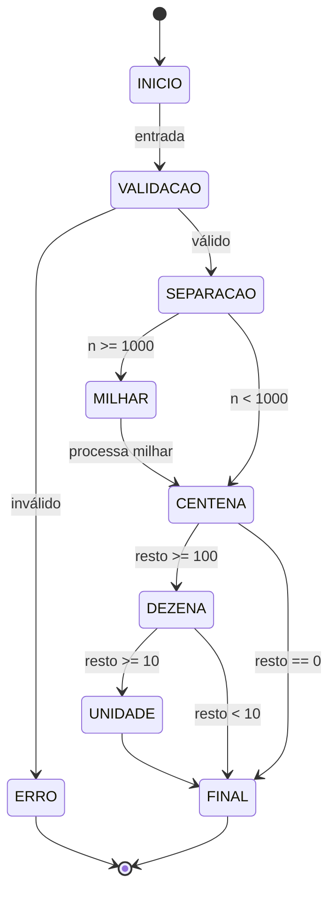

# Conversor de Número para Extenso (FSM - Mealy)

Este projeto implementa um conversor de números inteiros (0 a 999.999) para texto por extenso, utilizando o conceito de **Máquina de Estados Finitos (Mealy)**.

Suporta:
- 🇧🇷 Português
- 🇺🇸 Inglês

---

## 🧠 Modelagem como Máquina de Estados (Mealy)

A solução foi modelada como uma **Máquina de Mealy**, onde:

- Cada estado representa uma etapa do processamento do número
- A saída é gerada durante as transições (dependendo do estado + entrada)

---

## 🔄 Diagrama de Estados

## 📊 Tabela de Transições (Máquina de Mealy)

| Estado Atual | Entrada / Condição         | Próximo Estado | Saída Gerada                          |
|--------------|--------------------------|----------------|---------------------------------------|
| INICIO       | Recebe entrada           | VALIDACAO      | —                                     |
| VALIDACAO    | Entrada inválida         | ERRO           | "Entrada inválida" / "Invalid input"  |
| VALIDACAO    | Entrada válida           | SEPARACAO      | —                                     |
| SEPARACAO    | n ≥ 1000                 | MILHAR         | —                                     |
| SEPARACAO    | n < 1000                 | CENTENA        | —                                     |
| MILHAR       | milhar > 0               | CENTENA        | "<milhar> mil" / "<thousand>"         |
| CENTENA      | n ≥ 100                  | DEZENA         | "cento..." / "hundred..."             |
| CENTENA      | n = 0                    | FINAL          | —                                     |
| DEZENA       | 10 ≤ n ≤ 19              | UNIDADE        | "onze..." / "eleven..."               |
| DEZENA       | n ≥ 20                   | UNIDADE        | "vinte..." / "twenty..."              |
| DEZENA       | n < 10                   | FINAL          | —                                     |
| UNIDADE      | n ≥ 1                    | FINAL          | "um..." / "one..."                    |
| UNIDADE      | n = 0                    | FINAL          | —                                     |
| FINAL        | —                        | —              | Resultado completo                    |
| ERRO         | —                        | —              | Encerramento                          |