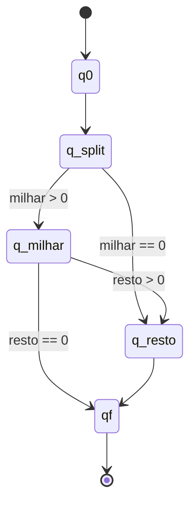

# Conversor de Numero para Extenso (FSM - Mealy)

Este projeto converte numeros inteiros de `0` a `999999` para texto por extenso em portugues e ingles, com interface grafica em Tkinter.

A logica central foi implementada como uma **maquina de Mealy** na classe `MealyFSM`.

## Idiomas suportados

- Portugues (`pt`)
- Ingles (`en`)

## Como executar

No diretorio `trab_2`:

```bash
python main.py
```

## Estrutura da solucao

- `lambda_ate_999(n, lang)`: funcao de saida para converter blocos de `0` a `999`
- `MealyFSM`: controla os estados, transicoes e log da simulacao
- `converter()`: valida entrada, executa a FSM e atualiza a interface

## Estados implementados

Os estados usados no codigo sao:

- `q0`: estado inicial
- `q_split`: separa em `milhar` e `resto`
- `q_milhar`: gera a parte de milhar
- `q_resto`: gera a parte final (`0` a `999`)
- `qf`: estado final

## Diagrama de estados (codigo atual)



## Tabela de transicoes e saidas (Mealy)

| Estado atual | Condicao de entrada | Proximo estado | Saida gerada |
| --- | --- | --- | --- |
| `q0` | inicio da execucao | `q_split` | log de estado inicial |
| `q_split` | `milhar > 0` | `q_milhar` | log com separacao (`milhar`, `resto`) |
| `q_split` | `milhar == 0` | `q_resto` | log com separacao (`milhar`, `resto`) |
| `q_milhar` | `resto > 0` | `q_resto` | texto do milhar (`mil`/`thousand`) |
| `q_milhar` | `resto == 0` | `qf` | texto do milhar (`mil`/`thousand`) |
| `q_resto` | sempre | `qf` | texto do bloco restante (`0..999`) |
| `qf` | encerramento | `qf` | log de estado final |

## Regra de montagem do resultado final

Ao final, quando existem duas partes em portugues (milhar + resto), o conector segue:

- usa `e` se `resto < 100` ou se `resto % 100 == 0`
- usa `,` nos demais casos

Exemplo:

- `20800` -> `vinte mil e oitocentos`

## Validacao de entrada

A interface aceita apenas inteiros no intervalo `0..999999`.

Entradas fora desse padrao exibem:

- `Entrada invalida!` (portugues)
- `Invalid input!` (ingles)